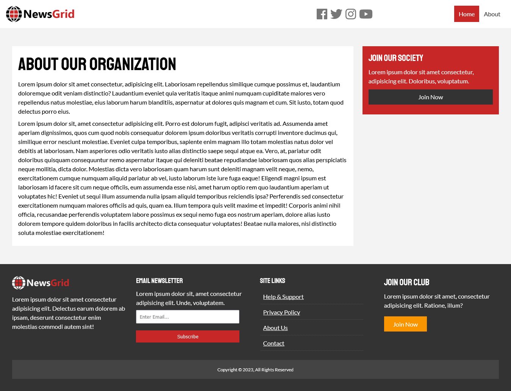
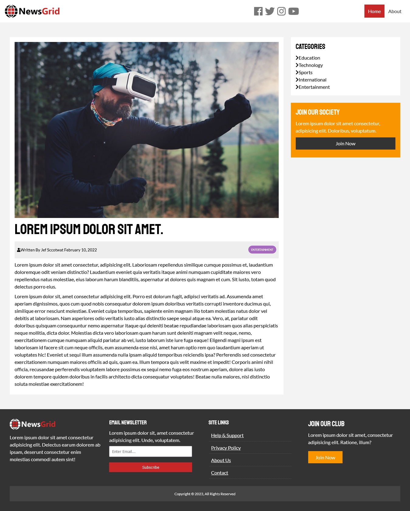
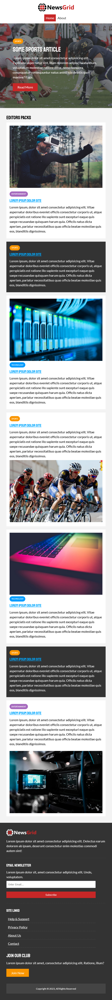

# Title-Info
> It is a News website template for react by using Vite App. It is fully responsive site. Here I've used CSS Grid system to design all the section. There are six components like as Header, Home, Signle Article component, Article details component, About and Footer component. I have design it for my practice about complex and Advance CSS properties. :slightly_smiling_face:

## Built With
- CSS Grid
- React
- React Router (Latest Version)
- Vite App

# ScreenShots

> Full Webiste

> About Page

> Article Page

> Responsive Mode (768px)

> Responsive Mode (Tablet)

> Responsive Mode (600px)

## Live Demo
For the link to the live demo, [Click here](https://github.com/asifmuntasir/react-news-grid-template.git)

## Getting Started
To get a local copy up and running you just need to follow the following steps;
- Clone this repository with
git clone https://github.com/asifmuntasir/frontend-design-template.git using your terminal or command line.
- run code `.` to open it in vscode
- run `npm install` in terminal
- run `npm run build` in terminal

## Author

👤 **Asif Muntasir**

- GitHub: [Asif_Muntasir](https://github.com/asifmuntasir)
- LinkedIn: [Asif_Muntasir](https://www.linkedin.com/in/asif-muntasir-shuaib/)
-Website: [Asif_Muntasir](https://asifmuntasir.github.io/)

## 🤝 Contributing

Contributions, issues, and feature requests are welcome!

Feel free to check the [issues page](../../issues/).

## Show your support

Give a ⭐️ if you like this project!

## Acknowledgments

- Sumit Saha and Traversy Media

## 📝 License

This project is [MIT](./MIT.md) licensed.
